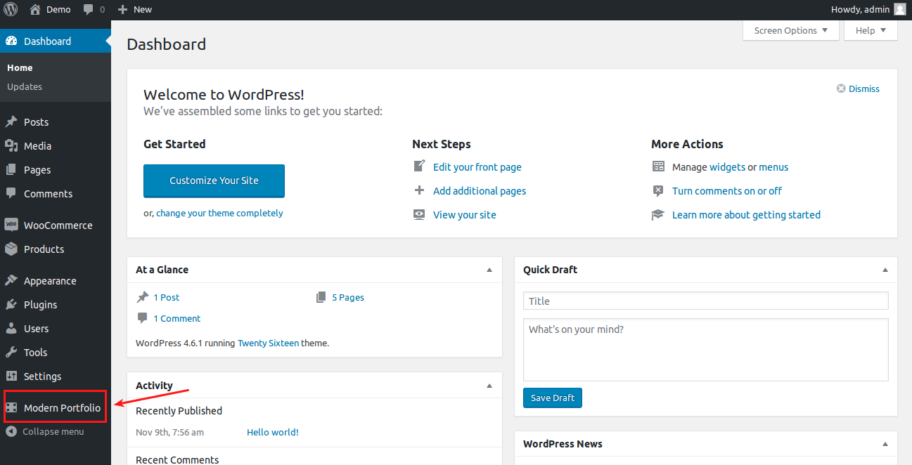
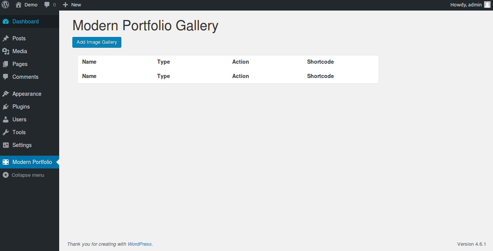
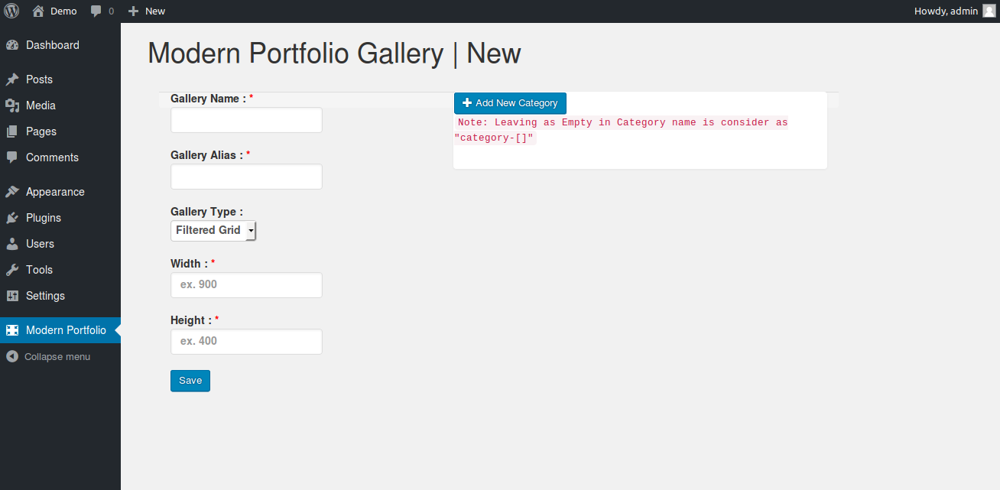
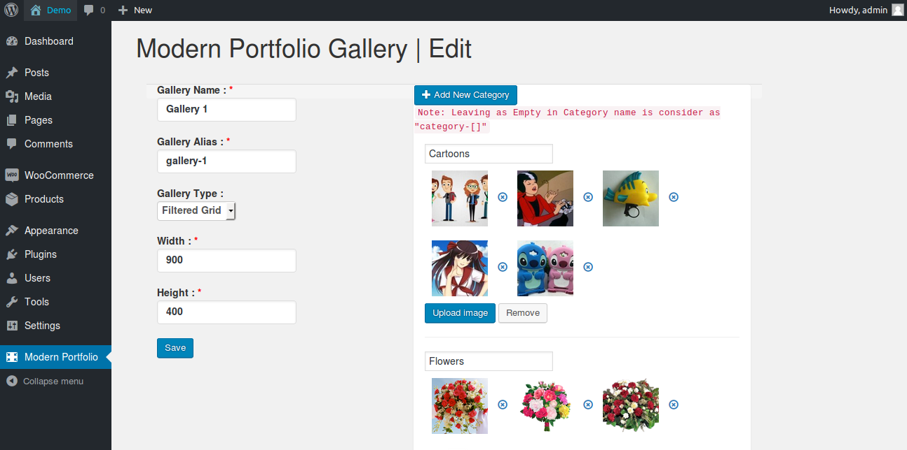
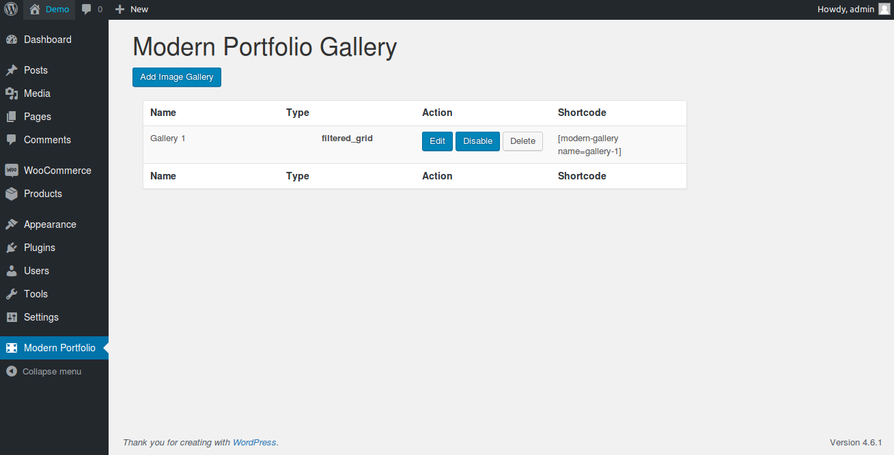
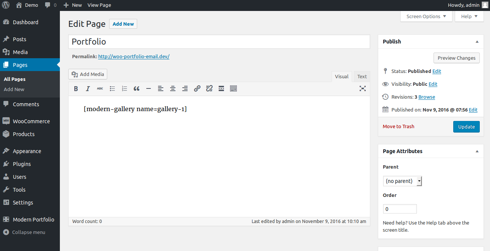
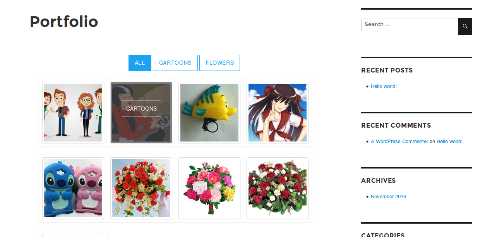
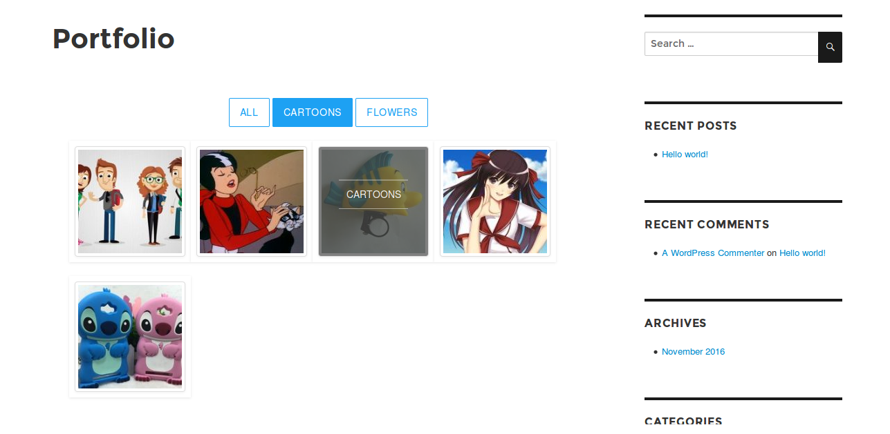

# Modern portfolio gallery

Modern portfolio is very simple and easy way to showcase your images and to create portfolios in your wordpress site. It is fully responsive and provides the features that you need to showcase your items.

## Requirements

1. PHP version 5.6 or greater
2. Wordpress 4.1 or higher

## Installation

1. Download Modern portfolio gallery and install it using wordpress plugin installer.
2. After installing plugin, go to Plugins -> Inst-installalled Plugins and activate Woocommerce Email Builder.
3. Once installed and activated, in wordpress dashboard go to Modern Portfolio and start creating your portfolio. 

## Configuration

1. Open modern portfolio plugin and click on **Add Image gallery** to create new portfolio. 
2. Fill the following parameters and click save

**Gallery Name:** Enter the name of the gallery

**Gallery Alias:** Enter the alias name for your portfolio

**Gallery Type:** Choose your portfolio style from the available two types such as Filtered grid and Grid.

**Width and height:** Enter the width and height of your portfolio in number. Your portfolio will be displayed based on the width and height entered here. 

1. Once finished filling basic parameters, click on **Add New Category** to create different categories for your portfolio. Enter the name of the category and upload the images for that category like below image 
2. Click Save.
3. Now go to Modern Portfolio dashboard and copy the shortcode of the portfolio you created. 
4. Go to Pages > Add New. Enter the page title and paste the shortcode in the text editor and save. 

## Frontend demo

